# TraderLab

개인 트레이더가 **"매매 의사결정의 품질"을 측정하고 훈련하는** 웹앱입니다.

> 종목 추천, 목표주가 예측, 매매 시그널은 절대 제공하지 않습니다. 이 프로젝트는 교육/훈련 도구이며, 투자자문이 아닙니다.

전체 설계 배경은 [`docs/SPEC.md`](docs/SPEC.md)에, AI 코딩 규칙은 [`CLAUDE.md`](CLAUDE.md)에 있습니다. **Phase 0~10 전체가 완성**되었고, 매직 링크 로그인부터 각 모듈까지 실제 배포 환경에서 직접 검증했습니다 — 이 README는 지금 이 저장소를 어떻게 설치·실행하고, 각 기능을 어떻게 쓰는지를 스크린샷과 함께 다룹니다.

**라이브 데모**: https://trader-lab-eight.vercel.app (이메일 매직 링크로 누구나 가입 가능, 비밀번호 없음)

## 목차

- [왜 이 앱인가](#왜-이-앱인가)
- [기술 스택](#기술-스택)
- [아키텍처 원칙](#아키텍처-원칙-요약)
- [기능 둘러보기 (사용 방법)](#기능-둘러보기-사용-방법)
- [프로젝트 구조](#프로젝트-구조)
- [시작하기](#시작하기)
- [스크립트](#스크립트)
- [데이터 수집기 (Python)](#데이터-수집기-python)
- [도메인 용어](#도메인-용어)
- [알려진 한계 / 의도적으로 미룬 것](#알려진-한계--의도적으로-미룬-것)
- [진행 상황](#진행-상황)
- [만들지 않는 것 (Anti-goals)](#만들지-않는-것-anti-goals)
- [고지](#고지)

## 왜 이 앱인가

개인 투자자가 지는 이유는 "좋은 종목을 못 찾아서"가 아니라 과잉거래, 처분효과(이익은 빨리 팔고 손실은 오래 쥐는 것), 결과 편향(운을 실력으로 착각), 과신(캘리브레이션 실패) 때문이라는 것이 반복적으로 확인된 실증 연구 결과입니다. 트레이딩은 "노이즈가 큰 저빈도 피드백 환경"이라 자연 학습이 잘 작동하지 않습니다. TraderLab은 아래 4가지 교육 원리로 인위적인 피드백 루프를 만듭니다.

1. **결과가 아닌 프로세스를 채점** — 프로세스 점수(`processScore`)와 결과(`realizedR`)를 완전히 분리해 2×2(`quadrant`)로 나눕니다. 가장 위험한 칸은 "나쁜 프로세스 + 좋은 결과"(운)입니다.
2. **사전 확약 → 사후 대조** — 진입 전에 무효화 조건·손절가·목표가를 잠그고, 청산 후 자동으로 대조합니다. 저장된 저널은 수정할 수 없고 append-only 이벤트만 허용됩니다.
3. **압축된 반복 훈련** — 종목명·날짜를 가린 블라인드 바 리플레이, 시나리오 드릴, 간격 반복 학습으로 실전 상황을 압축 경험합니다.
4. **정량화된 자기 인식** — "조급한 것 같다"를 편향 레이더 수치나 Brier Score 같은 실제 숫자로 바꿉니다.

홈 화면(`/`)에서 가장 큰 숫자는 항상 **프로세스 점수**입니다. 계좌 수익률이나 평가금액을 크게 보여주지 않는 것은 실수가 아니라 이 제품의 정체성입니다.

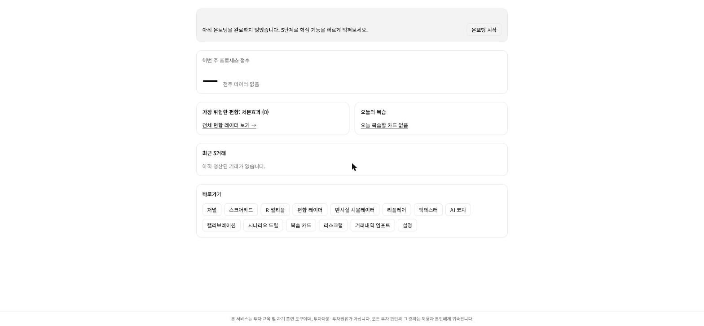
*실제 배포(https://trader-lab-eight.vercel.app)에서 로그인 직후 보이는 홈 화면. 아직 거래 기록이 없는 신규 계정 상태라 대부분의 위젯이 빈 상태로 보이지만, 레이아웃과 "가장 큰 숫자 = 프로세스 점수" 원칙은 그대로 확인할 수 있습니다.*

## 기술 스택

| 레이어 | 선택 | 비고 |
|---|---|---|
| 프레임워크 | Next.js 15 (App Router) + TypeScript (strict) | |
| 스타일 | Tailwind CSS v4 + shadcn/ui ("base-nova", `@base-ui/react` 기반) | Radix가 아니라 Base UI — `asChild` 대신 `render` prop 등 API가 다름 |
| DB / 인증 | Supabase (Postgres, Auth, Row Level Security) | |
| ORM | Drizzle ORM (+ drizzle-kit 마이그레이션) | |
| 차트 | lightweight-charts(가격 캔들, `app/replay`·`app/calibration/quiz`), Recharts(통계 차트) | |
| AI | Anthropic Claude API (`app/api/ai/coach`) | 서버 전용, `ANTHROPIC_API_KEY` |
| 데이터 수집 | Python: pykrx + FinanceDataReader (`scripts/collector/`) | Node 앱과 별도 프로세스, 같은 DB에 upsert |
| 테스트 | Vitest (`lib/domain/`, `lib/csv.ts` 등 순수 함수 226개 테스트) | |

`CLAUDE.md`에 Zustand·TanStack Query도 스택으로 명시되어 있었지만, 실제 구현에서는 Server Component + Server Action + 얕은 `useState` 조합만으로 모든 화면이 충분히 해결되어 두 라이브러리는 최종적으로 사용하지 않았습니다.

## 아키텍처 원칙 (요약)

전체 규칙은 `CLAUDE.md` 참조. 핵심만 요약하면:

- **모든 도메인 계산은 `lib/domain/`의 순수 함수로 작성합니다.** DB·fetch·React·`Date.now()`·`Math.random()`을 참조하지 않고, 현재 시각이 필요하면 인자로 주입받습니다. 이 폴더의 모든 export 함수는 같은 이름의 `.test.ts`를 가집니다(현재 15개 모듈, 테스트 다수).
- **React 컴포넌트에는 비즈니스 계산 로직을 넣지 않습니다.** 계산은 항상 `lib/domain`을 호출합니다(클라이언트 컴포넌트에서 실시간 미리보기를 위해 직접 import하는 것은 허용 — 예: 저널 작성 폼의 R 실시간 계산, 온보딩의 R-multiple 슬라이더).
- **DB 접근은 Server Component / Server Action / Route Handler에서만.** 클라이언트 컴포넌트에서 직접 접근하지 않습니다.
- **RLS는 모든 사용자 테이블에 필수.** 단, Drizzle(`lib/db/index.ts`)은 `DATABASE_URL`로 직접 연결하므로 Postgres의 `auth.uid()`가 채워지지 않습니다 — 즉 RLS가 Drizzle 쿼리를 자동으로 좁혀주지 않습니다. 그래서 Drizzle로 쓰는 모든 쿼리는 `supabase.auth.getUser()`로 얻은 사용자 id로 **명시적으로** 필터링해야 합니다. RLS는 defense-in-depth로 유지됩니다.
- **서버 전용 키(`SUPABASE_SERVICE_ROLE_KEY`, `ANTHROPIC_API_KEY`)는 `NEXT_PUBLIC_` 접두사를 절대 붙이지 않습니다.**
- **저널은 append-only.** 저장 후 핵심 필드(논거/무효화조건/손절가/목표가/확신도) 수정 불가, 이후 변경은 `trade_events`에만 추가.
- **금액·가격·수량 비교/집계 시 `lib/domain/money.ts`의 `round()`를 사용**해 부동소수 오차를 방지합니다.
- **백테스트·리플레이는 look-ahead 금지.** 신호는 종가에서 판정하고 체결은 다음 봉 시가로, 리플레이는 세션 종료 전까지 종목명·날짜를 서버 밖으로 절대 내보내지 않습니다.

## 기능 둘러보기 (사용 방법)

로그인 후 홈(`/`)의 **바로가기** 카드에서 아래 모든 페이지로 이동할 수 있습니다. 처음 방문이라면 홈 화면의 배너로 [온보딩](#m0-온보딩)부터 시작하는 것을 권장합니다.

> 아래 스크린샷은 모두 실제 배포(https://trader-lab-eight.vercel.app)에서 매직 링크로 로그인해 직접 촬영한 것입니다. 거래 기록이 아직 없는 신규 계정 기준이라 저널·스코어카드처럼 실거래 데이터에 의존하는 화면은 빈 상태로 보이고, 리플레이·백테스터·드릴·SRS·캘리브레이션 퀴즈처럼 시딩된 콘텐츠가 있는 화면은 실제 동작 화면으로 보입니다.

### 로그인 — `/login`

이메일만 입력하면 비밀번호 없이 매직 링크가 발송됩니다. 계정이 없으면 최초 로그인 시 자동 가입됩니다.

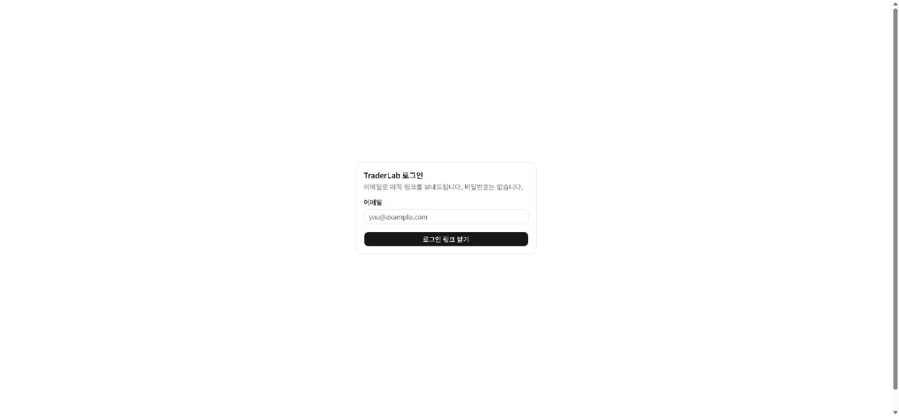

### M0. 온보딩 — `/onboarding`

첫 로그인 시 5단계로 핵심 개념을 익힙니다: (1) 계좌 규모·리스크% 설정 → (2) 손절폭 슬라이더로 R-multiple 체감 → (3) 저널 작성 튜토리얼(샘플 데이터, 실제 작성 페이지로 연결) → (4) 리플레이 L1 세션 1회 체험(강제) → (5) 10문항 캘리브레이션 퀴즈로 베이스라인 Brier Score 기록. 중간에 나가도 홈 화면의 배너로 돌아오면 마지막으로 완료한 단계부터 이어집니다(`profiles.onboarding_step`). 완료 여부는 `profiles.onboarding_completed_at`에 기록됩니다.

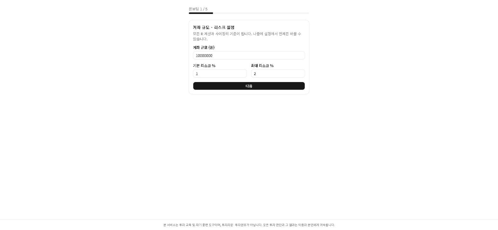

### M1. 의사결정 저널 — `/journal`

- **`/journal/new`**: 진입 전 논거(50자+)·무효화 조건(20자+)·손절가·목표가·확신도·사이징을 미리 선언합니다. 셋업 유형·손절 근거·목표가2·감정 태그처럼 기본값이 있는 항목은 "고급 옵션" 아코디언에 접어둬서, 처음 보이는 화면은 실제로 생각해야 하는 필드만 남깁니다. 저장 즉시 잠기며(append-only), 이후 저널 화면에서 수정할 수 없습니다. 직전 거래가 손실이었다면 보복매매 경고 배너가 뜹니다.
- **`/journal/[id]`**: 계획 vs 실제 대조표(불일치 항목은 주황색 강조), 타임라인, AI 코치(프리모템/포스트모템) 진입점을 제공합니다.
- **`/journal/[id]/close`**: 청산 기록. 데이터 수집기(`scripts/collector`)가 해당 종목·기간을 이미 백필했다면 보유 중 최저/최고가가 실제 일봉 데이터로 자동 채워지고, 아니면 직접 입력합니다(둘 다 MAE/MFE 계산에 사용되며, 자동 채움이어도 필드는 항상 수정 가능합니다).
- **`/journal`**: 기간·소스(`live`/`replay`)·사분면으로 필터링되는 목록.

| 저널 목록 (`/journal`) | 새 저널 작성 (`/journal/new`) |
|---|---|
| 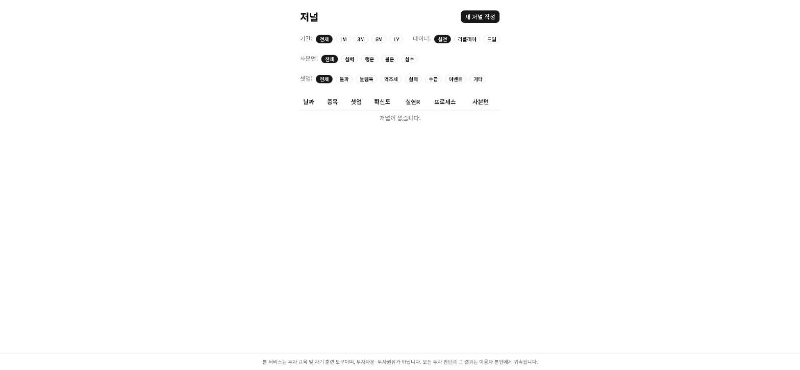 | 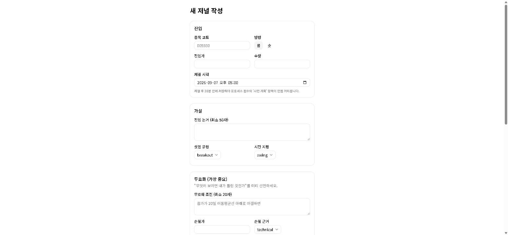 |

### M2. 프로세스 스코어카드 — `/scorecard`

프로세스 점수 vs 실현 R 산점도(사분면 배경색), 이번 달 사분면 비중(전월 대비), 프로세스 항목별 평균(가장 약한 항목 강조), 프로세스-결과 피어슨 상관계수를 보여줍니다. 거래 기록이 아직 없다면 "샘플로 미리보기"로 40건의 가상 거래를 채운 화면을 먼저 볼 수 있습니다(실제 데이터가 아님을 배너로 항상 표시).

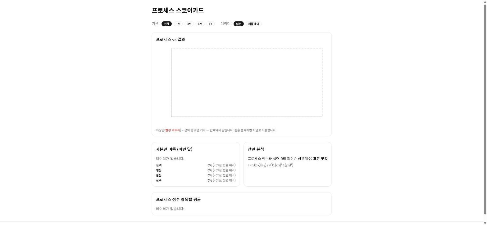

### M3. R-multiple 대시보드 — `/metrics`

승률·기대값·Profit Factor·SQN·최대 연속 손실 등 핵심 지표(표본 30건 미만은 신뢰구간과 함께 흐리게 표시), R 분포 히스토그램, 누적 R 곡선, 켈리 게이지, 여기에도 "샘플로 미리보기" 토글이 있습니다. CSV로 임포트한 거래는 R-multiple 통계에서 제외되지만, 별도 카드에서 승률·손익만 따로 집계해 보여줍니다.

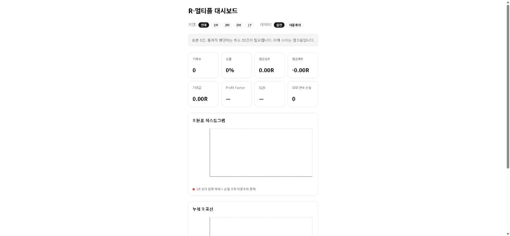

### M4. 행동 편향 레이더 — `/bias`

처분효과·보복매매·과잉거래·물타기·손절지연·FOMO추격 6축 레이더. 각 축 아코디언 카드는 ①수치+임계값 배지 ②학술적 설명(연구자·연도 포함) ③실제 해당 거래 목록+추정 손실 R ④다음 거래에 적용할 처방 순으로 구성됩니다.

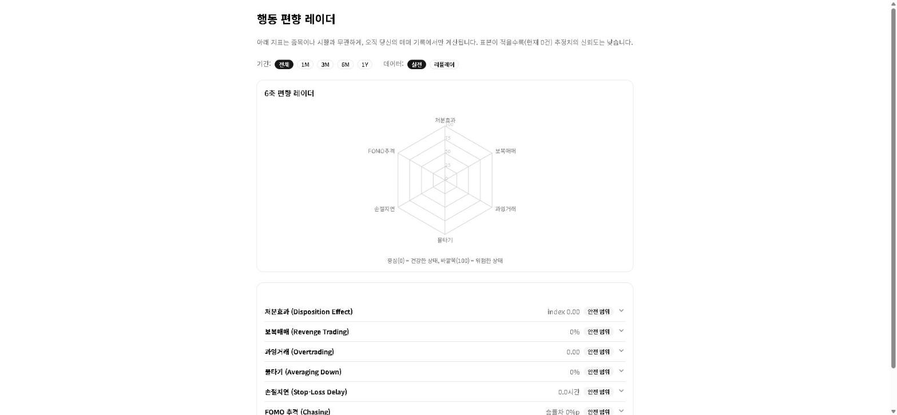

### M5. 캘리브레이션 트레이너 — `/calibration`, `/calibration/quiz`

선언한 확신도와 실제 적중률을 비교하는 신뢰도 곡선(y=x 점선, 점 크기=표본 수), Brier Score(동전던지기 0.25 기준선), ECE, 자동 진단(과신/과소신뢰/양호). `/calibration/quiz`는 종목·날짜를 가린 120봉 차트 20개를 보고 "5거래일 후 상승 확률"을 맞히는 주간 훈련입니다. 최근 30건 Brier < 0.18이면 배지를 획득합니다.

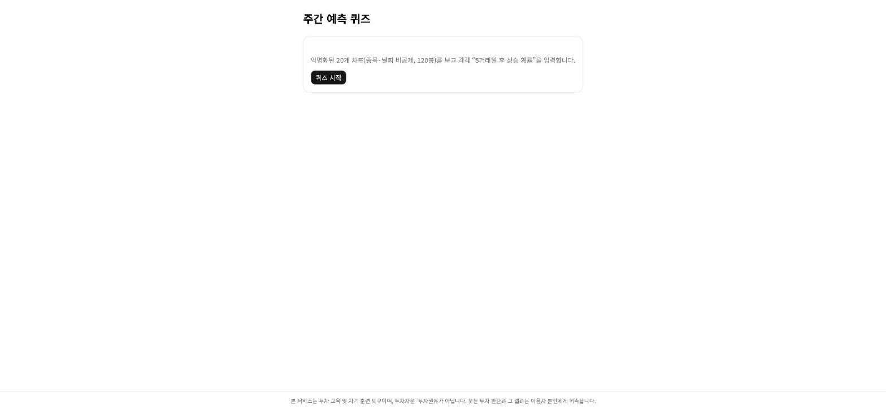

### M6. 반사실 시뮬레이터 — `/counterfactual`

같은 거래 기록에 "손절을 항상 지켰다면", "물타기를 안 했다면" 등 7가지 시나리오를 적용해 누적 R 곡선을 겹쳐 보여줍니다. 모든 시나리오는 진입 시점에 이미 선언된 규칙만 사용하며 미래 정보를 참조하지 않습니다. 개선폭이 가장 큰 시나리오를 한 문장으로 요약합니다.

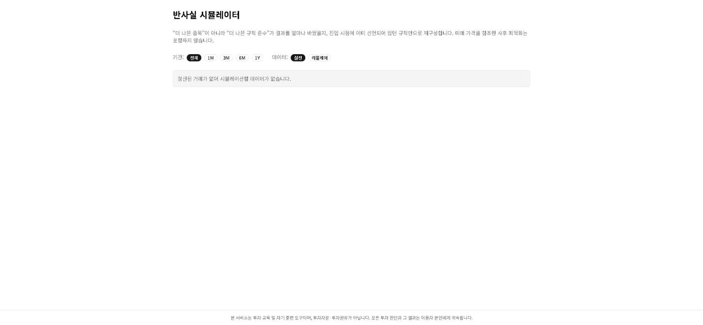

### M7. 블라인드 바 리플레이 — `/replay`

종목명·날짜를 가린 과거 실제 시세를 한 봉씩 재생합니다(스페이스 없이 버튼/클릭으로 진행). 매수 시 축약 저널(논거·무효화·손절·목표·확신도) 입력이 강제되고, 종목명은 세션을 종료해야 공개됩니다. 서버가 유일하게 미래 봉 데이터를 쥐고 있어 클라이언트로는 절대 넘어가지 않습니다. **화면이 넓은 데스크톱/태블릿에 최적화**되어 있습니다.

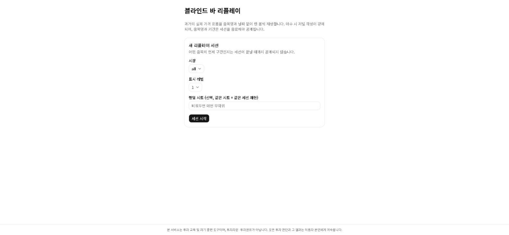

### M8. 시나리오 드릴 — `/drills`, `/drills/consistency`

"손절직전반등", "3연속손실후진입" 등 20가지 실전 상황에서 4지선다로 대응을 고릅니다. 정답/오답이 아니라 **프로세스 정합성**(사전 규칙과 일관된 선택인가)으로 채점합니다. 같은 카드는 90일 후 다시 출제되며, `/drills/consistency`에서 그때와 지금의 판단이 얼마나 안정적이었는지 확인할 수 있습니다.

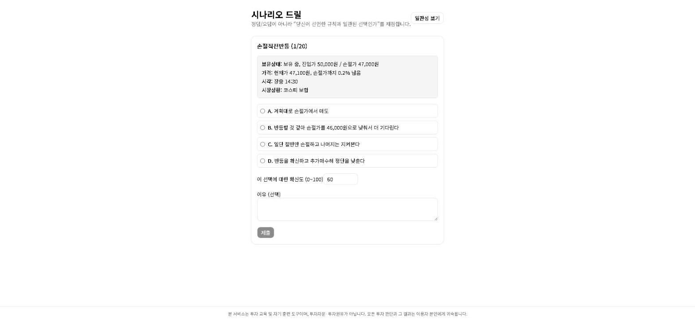

### M9. 노코드 룰 백테스터 — `/backtest`

드롭다운으로 진입/제외 조건(이동평균·RSI·거래량 등)과 손절/목표/시간손절, 리스크%를 조합해 코드 없이 규칙을 만듭니다. 신호는 종가, 체결은 다음 봉 시가로만 처리합니다. 결과는 항상 In-sample(앞 70%)과 Out-of-sample(뒤 30%)을 나란히 보여주고, OOS 성과가 IS의 절반 미만이면 과최적화 경고를, 같은 규칙을 20회 넘게 실행하면 다중검정 경고를 띄웁니다. 최악의 연속 6개월 구간도 평균과 동일한 비중으로 표시됩니다.

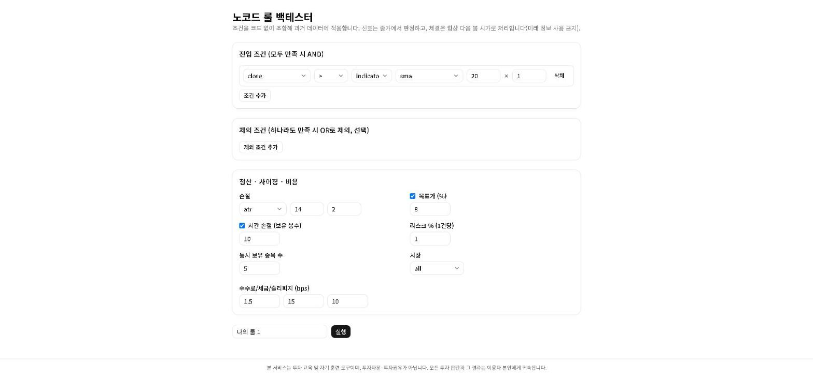

### M10. AI 소크라테스 코치 — `/coach` (+ 저널 상세 페이지에 통합)

Anthropic Claude API를 서버에서만 호출합니다. 답을 주지 않고 관찰·질문·행동재무학 개념·검증 가능한 실험 1개를 제시하는 형식으로만 응답하며, 특정 종목의 매수/매도 의견이나 시황 단정은 시스템 프롬프트로 원천 차단되어 있습니다. 저널 상세 페이지에서 프리모템(진입 직후)·포스트모템(청산 후)을 요청할 수 있고, `/coach`에서 주간/월간 리뷰와 진행 중인 실험의 준수율(다음 10거래 중 프로세스 점수 70+ 비율)을 확인합니다. 하루 호출 한도가 있고 주간/월간 리뷰는 같은 기간 재요청 시 캐시된 결과를 반환합니다.

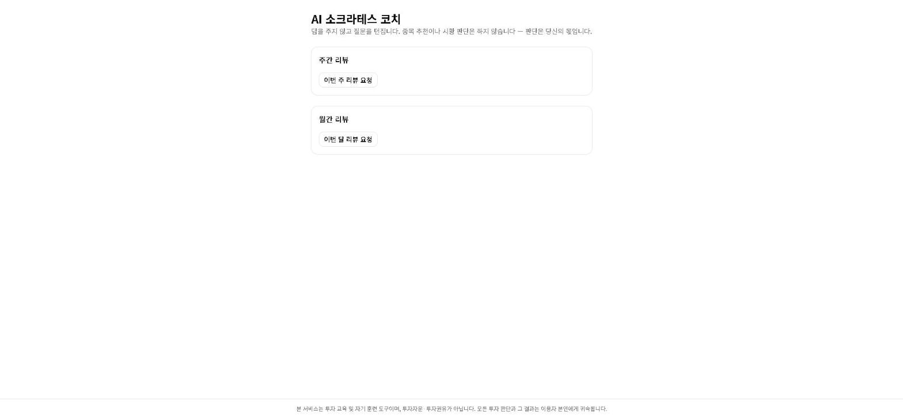

### M11. 간격 반복 학습(SRS) — `/cards`

SM-2 알고리즘(1→3→7→16→35일 간격)으로 리스크관리·행동재무학·시장미시구조·한국시장제도·통계 5개 분야 60장의 공용 카드를 복습합니다. 손절 미준수 3회, 처분효과 지수 0.15 초과, 보복매매 3회, 물타기 2회 등 **자신의 실제 거래 패턴에서 자동 생성된 개인화 카드**(실제 날짜·종목·수치 포함)도 함께 섞입니다. 앞면 확인 → [기억남/애매/모름] → 뒷면 공개 → 등급 입력(스페이스=뒤집기, 1~4=등급) 흐름입니다.

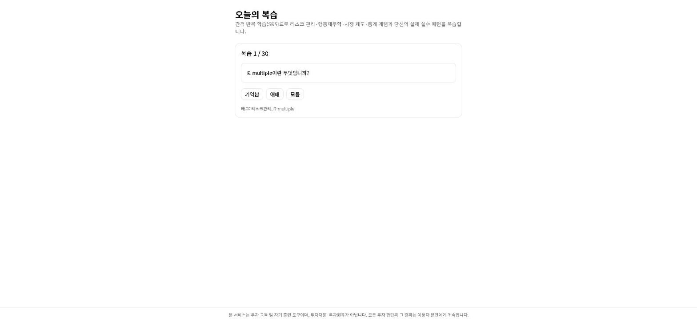

### M12. 몬테카를로 리스크랩 — `/risklab`

실제 거래 30건 이상이면 자신의 R 분포를 자동으로 불러오고, 아니면 승률·평균승R·평균패R을 직접 입력합니다. 부트스트랩 복원추출로 1,000회×200거래를 시뮬레이션해 최종 수익률/MDD 분포, 파산 확률(-50%), N연속 손실 확률을 보여줍니다. 핵심은 **리스크% 슬라이더 비교**: 0.5/1/2/3/5%를 동시에 계산해 "같은 실력이라도 사이징만으로 파산 확률이 얼마나 달라지는지"를 직접 비교합니다.

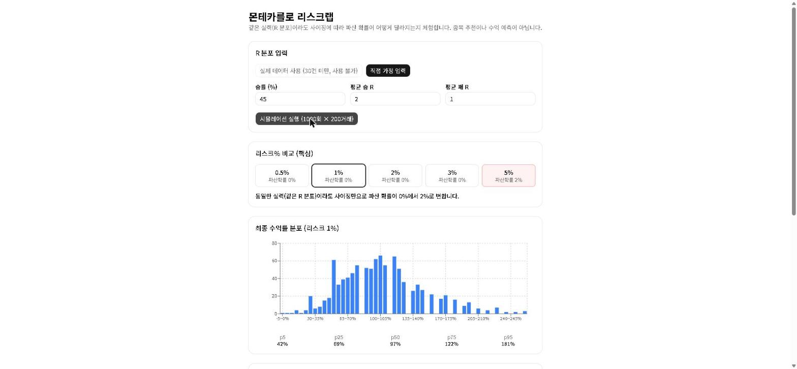

### 부가 기능

- **`/settings`** — 계좌 규모, 기본/최대 리스크%, 수수료·세금·슬리피지, 주간 요약 이메일 수신 여부, 전체 데이터 JSON/CSV 내보내기.
- **주간 요약 이메일** — `RESEND_API_KEY`가 설정되어 있으면 매주 월요일 08:00 KST에 이번 주 프로세스 점수(전주 대비)·복습 대기 카드 수·진행 중인 AI 코치 실험 준수율을 이메일로 요약해 보냅니다(`app/api/cron/weekly-digest`, `.github/workflows/weekly-digest.yml`). `/settings`에서 언제든 끌 수 있습니다.
- **`/import`** — 증권사 CSV(EUC-KR 인코딩 지원)를 업로드하고 컬럼을 매핑해 과거 거래를 임포트합니다. 사전 계획이 없는 거래이므로 프로세스 점수는 매기지 않고 "사전 계획 없음" 태그가 자동으로 붙습니다.

| 설정 (`/settings`) | CSV 임포트 (`/import`) |
|---|---|
| 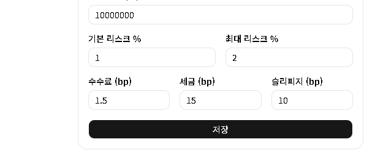 | 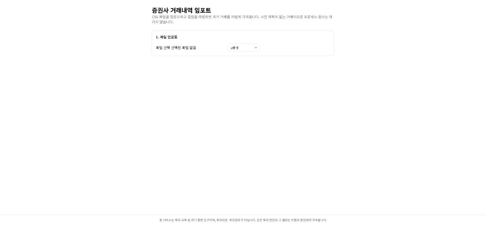 |

## 프로젝트 구조

```
trader-lab/
├── CLAUDE.md                        # AI 코딩 규칙 (고정 스택 + 아키텍처 불변 규칙)
├── docs/SPEC.md                     # 전체 설계 문서 (Phase 0~10 프롬프트 전문)
├── app/
│   ├── page.tsx                     # 홈 대시보드 (M0 요약 위젯)
│   ├── layout.tsx / loading.tsx / error.tsx / not-found.tsx
│   ├── (auth)/login/, auth/callback/  # 매직 링크 로그인
│   ├── onboarding/                  # 5단계 온보딩
│   ├── journal/                     # M1 의사결정 저널
│   ├── scorecard/                   # M2 프로세스 스코어카드
│   ├── metrics/                     # M3 R-multiple 대시보드
│   ├── bias/                        # M4 행동 편향 레이더
│   ├── calibration/(quiz/)          # M5 캘리브레이션
│   ├── counterfactual/              # M6 반사실 시뮬레이터
│   ├── replay/[sessionId]/          # M7 블라인드 바 리플레이
│   ├── drills/(consistency/)        # M8 시나리오 드릴
│   ├── backtest/                    # M9 노코드 룰 백테스터
│   ├── api/ai/coach/, coach/        # M10 AI 소크라테스 코치
│   ├── cards/                       # M11 간격 반복 학습(SRS)
│   ├── risklab/                     # M12 몬테카를로 리스크랩
│   ├── settings/, import/           # 설정, CSV 임포트
│   └── api/{backtest,calibration,export,replay}/  # Route Handlers
├── lib/
│   ├── domain/                      # 순수 함수 17개 모듈, 전부 .test.ts 보유
│   │   ├── types.ts, money.ts, r-multiple.ts, process-score.ts, metrics.ts
│   │   ├── bias-metrics.ts, calibration.ts, monte-carlo.ts, counterfactual.ts
│   │   ├── replay.ts, indicators.ts, rule-dsl.ts, backtest.ts
│   │   ├── coach.ts, drills.ts, srs.ts, price-range.ts, sample-data.ts
│   ├── queries/                     # DB 접근 (Drizzle, 사용자 id로 명시적 필터링)
│   ├── db/{schema.ts,index.ts,mappers.ts}
│   ├── supabase/{client,server,middleware,admin}.ts  # admin = 서비스 롤 (주간 이메일 발송용)
│   ├── validation/journal.ts        # zod 스키마
│   ├── csv.ts                       # RFC4180 CSV 파서/직렬화 (임포트·내보내기 공용)
│   ├── email.ts                     # 주간 요약 이메일 본문 생성 + Resend 발송
│   └── labels.ts                    # 한글 표시 레이블
├── drizzle/migrations/              # 스키마 + RLS/트리거 마이그레이션 (0000~0006)
├── scripts/
│   ├── collector/                   # Python 데이터 수집기 (자체 README)
│   ├── seed-ohlcv.mjs                # 리플레이/백테스트용 합성 시세 데이터
│   ├── seed-drills.mjs               # 시나리오 드릴 카드 20종
│   └── seed-cards.mjs                # SRS 공용 덱 60장
├── .github/workflows/collector.yml  # 데이터 수집기 예약 실행
├── middleware.ts                    # 세션 갱신 + 보호 라우트
└── components/ui/                   # shadcn/ui (base-nova) 컴포넌트
```

## 시작하기

### 1. 의존성 설치

```bash
npm install
```

### 2. Supabase 프로젝트 연결

이미 프로젝트가 있다면 [Supabase 대시보드](https://supabase.com/dashboard) → **Project Settings → API / Database**에서 아래 값을 확인하세요. 없다면 새로 만든 뒤 동일하게 진행합니다.

`.env.example`을 복사해 `.env.local`을 만들고 값을 채웁니다(이 파일은 git에 커밋되지 않습니다):

```bash
cp .env.example .env.local
```

| 변수 | 위치 | 비고 |
|---|---|---|
| `NEXT_PUBLIC_SUPABASE_URL` | Project Settings → API | `https://<project-ref>.supabase.co` |
| `NEXT_PUBLIC_SUPABASE_ANON_KEY` | Project Settings → API Keys | publishable/anon 키 (브라우저 노출 가능) |
| `SUPABASE_SERVICE_ROLE_KEY` | Project Settings → API Keys | **서버 전용.** secret/service_role 키 |
| `DATABASE_URL` | Project Settings → Database → Connect → ORM → Drizzle | 비밀번호의 특수문자는 URL 인코딩 필요(예: `@` → `%40`) |
| `ANTHROPIC_API_KEY` | [console.anthropic.com](https://console.anthropic.com/) | **서버 전용.** `/api/ai/coach`(M10 AI 코치)에서만 사용 |
| `NEXT_PUBLIC_SITE_URL` | 배포된 실제 도메인 | 매직 링크 이메일의 리다이렉트 주소를 만드는 데 사용(`app/(auth)/login/actions.ts`). **로컬 개발에서는 비워두면 `http://localhost:3000`으로 자동 대체되어 필요 없지만, Vercel 등에 배포할 때는 반드시 실제 배포 URL로 설정해야 합니다** — 설정하지 않으면 매직 링크가 `localhost`로 연결을 시도해 개발자 외에는 아무도 로그인할 수 없습니다(실제로 겪은 문제). |
| `RESEND_KEY` | [resend.com](https://resend.com) (무료 티어: 월 3,000통) | **서버 전용, 선택.** 주간 요약 이메일(`/api/cron/weekly-digest`)에 사용. 없으면 크론이 에러 없이 조용히 건너뜁니다. |
| `RESEND_FROM_EMAIL` | Resend에서 인증한 발신 도메인 | 선택. 기본값은 Resend의 테스트용 `onboarding@resend.dev`. |
| `CRON_SECRET` | 직접 생성 (예: `openssl rand -hex 32`) | **서버 전용, 선택.** GitHub Actions Secrets에 동일한 값을 등록해 `/api/cron/weekly-digest`를 인증하는 데 사용. |

또한 Supabase 대시보드 **Authentication → URL Configuration → Redirect URLs**에 아래를 추가해야 매직 링크 로그인이 동작합니다(로컬 개발용 + 배포 도메인용 모두):

```
http://localhost:3000/auth/callback
http://localhost:3000/**
https://<배포 도메인>/auth/callback
https://<배포 도메인>/**
```

### 3. DB 마이그레이션 적용

```bash
npm run db:migrate
```

스키마를 수정한 뒤에는 `npm run db:generate`로 새 마이그레이션 SQL을 생성하고, 검토 후 `npm run db:migrate`로 적용합니다. RLS 정책이나 트리거처럼 스키마 파일로 표현되지 않는 변경은 `drizzle-kit generate --custom`으로 빈 마이그레이션을 만들고 SQL을 직접 작성합니다(`drizzle/migrations/0001_rls_and_profile_trigger.sql` 참고).

### 4. 테스트/체험용 데이터 시딩 (권장)

`app/replay`·`app/backtest`·`app/calibration/quiz`는 가격 데이터가 있어야 동작하고, `app/drills`·`app/cards`는 콘텐츠가 시딩되어 있어야 복습할 카드가 보입니다. 진짜 시세는 아래 [데이터 수집기](#데이터-수집기-python)로 채우기 전까지, 우선 아래 3개 스크립트로 합성/콘텐츠 데이터를 채워두는 것을 권장합니다:

```bash
npm run db:seed-ohlcv    # 리플레이·백테스트·캘리브레이션 퀴즈용 합성 시세 3종목
npm run db:seed-drills   # 시나리오 드릴 카드 20종
npm run db:seed-cards    # SRS 공용 덱 60장
```

셋 다 upsert 기반이라 여러 번 실행해도 안전합니다.

### 5. 개발 서버 실행

```bash
npm run dev
```

[http://localhost:3000](http://localhost:3000) 접속 시 로그인하지 않은 요청은 `/login`으로 리다이렉트됩니다. 매직 링크로 가입하면 홈 화면에 온보딩 배너가 뜹니다 — [M0. 온보딩](#m0-온보딩)부터 시작하면 전체 기능을 순서대로 훑어볼 수 있습니다.

### 6. 배포 (Vercel)

라이브 배포: **https://trader-lab-eight.vercel.app** (Vercel 프로젝트가 이 GitHub 저장소와 연결되어 있어 `main` 브랜치에 푸시하면 자동으로 재배포됩니다.)

직접 새로 배포하는 경우 체크리스트:

1. `vercel link`로 프로젝트 연결 (소문자 프로젝트명 필요).
2. 위 필수 환경변수 5개 + **`NEXT_PUBLIC_SITE_URL`(실제 배포 도메인, 필수)**을 `vercel env add <이름> production`으로 등록. `RESEND_KEY`/`RESEND_FROM_EMAIL`/`CRON_SECRET`은 주간 요약 이메일을 쓸 때만 선택적으로 추가하면 됩니다. `NEXT_PUBLIC_*` 값은 빌드 시점에 번들에 박히므로 값을 바꾸면 반드시 재배포해야 합니다.
3. Supabase 대시보드에 배포 도메인의 `/auth/callback`과 `/**`를 Redirect URLs에 추가.
4. `vercel --prod`로 배포.
5. Supabase 무료 플랜은 내장 이메일 발송 한도가 시간당 매우 낮습니다(수 통 수준). 여러 계정으로 자주 테스트해야 한다면 Authentication → Emails에서 커스텀 SMTP(Resend, Gmail 등)를 연결하는 것을 권장합니다.

## 스크립트

| 명령 | 설명 |
|---|---|
| `npm run dev` | 개발 서버 |
| `npm run build` | 프로덕션 빌드 (타입체크 + lint 포함) |
| `npm run start` | 프로덕션 서버 실행 |
| `npm run lint` | ESLint |
| `npm run test` | Vitest 전체 실행 (1회) |
| `npm run test:watch` | Vitest watch 모드 |
| `npm run db:generate` | 스키마 변경분으로 마이그레이션 SQL 생성 |
| `npm run db:migrate` | 대기 중인 마이그레이션을 DB에 적용 |
| `npm run db:seed-ohlcv` | 리플레이/백테스트/캘리브레이션 퀴즈용 합성(가짜) OHLCV·수급 데이터 시딩 (실제 시세 아님) |
| `npm run db:seed-drills` | 시나리오 드릴 카드 20종 시딩 |
| `npm run db:seed-cards` | SRS 공용 덱 60장 시딩 |

## 데이터 수집기 (Python)

`scripts/collector/`는 Node 앱과 독립적으로 동작하는 Python 스크립트로, 같은 Supabase Postgres에 실제 KOSPI/KOSDAQ 시세를 upsert합니다. 전체 ~2,765개 종목이 아니라 **실제 거래대금 기준 상위 약 300종목만 추적**해 저장공간을 제한합니다(`select_universe.py` — 시가총액은 로그인 없이 구할 수 없어 실제 거래대금을 대용 지표로 사용). 자세한 설치·실행법과 실제로 검증된 제약은 [`scripts/collector/README.md`](scripts/collector/README.md)에 있습니다. 요약(최초 설정):

```bash
cd scripts/collector
pip install -r requirements.txt
python master.py                                    # 1. 종목 마스터 갱신
python backfill.py --all-tickers --start 2026-08-01  # 2. 전종목 짧은 기간(랭킹용)
python select_universe.py --top 300                  # 3. 거래대금 상위 종목만 추적 지정 (나머지 자동 삭제)
python backfill.py                                   # 4. 추적 종목만 2년 전체 백필
python daily.py                                      # 이후 매일 증분 수집 (추적 종목만)
```

`.github/workflows/collector.yml`이 평일 18:00 KST에 `daily.py`를 자동 실행합니다(저장소 Secrets에 `DATABASE_URL` 필요, `KRX_ID`/`KRX_PW`는 투자자 수급용 선택 사항). 실제 시세로 백필하기 전까지는 4단계의 `db:seed-*` 스크립트로 만든 합성 데이터로 모든 기능을 테스트할 수 있습니다.

## 도메인 용어

코드에서 아래 이름을 그대로 사용합니다 (상세 산식은 `lib/domain/` 참조):

- **`R` (R-multiple)**: 1R = 진입 시 감수하기로 한 손실액. `realizedR = (exitPrice - entryPrice) / (entryPrice - stopPrice)`(long 기준)
- **`plannedR`**: 진입 시점의 목표 손익비
- **`processScore`**: 0~100. 결과와 완전히 독립적인 프로세스 점수
- **`quadrant`**: `'skill' | 'luck' | 'badluck' | 'mistake'` — 프로세스 점수 70 기준 × 실현 R 양/음 기준 2×2
- **`MAE` / `MFE`**: 보유 중 최대 역행폭 / 최대 순행폭 (R 단위)
- **`invalidation`**: 진입 시 선언한 "내가 틀렸음을 알 수 있는 조건"
- **`expectancy`**: `winRate * avgWinR - lossRate * avgLossR`
- **`source`**: `'live' | 'replay' | 'drill'` — 실전/리플레이/드릴 데이터는 섞지 않음
- **Brier Score / ECE**: 확신도 예측의 정확도 지표. 동전던지기(항상 50%)는 정의상 정확히 0.25
- **`ease` / `intervalDays`**: SM-2 간격 반복 알고리즘의 난이도 계수·복습 간격(일)
- **`consistencyScore`**: 시나리오 드릴을 90일 간격으로 재출제했을 때 두 응답 점수의 근접도(100에 가까울수록 일관적)
- **파산 확률**: 몬테카를로 시뮬레이션에서 계좌가 -50%에 도달한 시행 비율

## 알려진 한계 / 의도적으로 미룬 것

각 기능 구현 중 실제로 부딪힌 제약과, 무리하게 우회하지 않고 정직하게 남겨둔 지점들입니다.

- **`live` 소스 실시간(장중) 시세 없음**: MAE/MFE는 데이터 수집기가 백필한 종목·기간이면 일봉으로 자동 계산되지만(장중 순간 고점/저점은 반영 안 됨), 백필되지 않은 종목은 여전히 직접 입력합니다. 홈 화면의 "진행 중 포지션"도 계획 가격만 보여주고 현재가 대비 위치는 표시하지 않습니다.
- **리플레이 레벨 4/5 일부 미구현**: 60분봉 전환(L4)과 코스피 지수 오버레이(L5)는 분봉·지수 데이터 파이프라인이 아직 없어 준비 중 상태입니다. 캔들·이동평균·거래량(L1~L3)은 완전히 동작합니다.
- **FOMO 편향 감지는 감정 태그 기반 근사치**: 실시간 분봉 없이 "당일 급등 여부"를 판단할 수 없어, 진입 시 스스로 붙인 "FOMO" 감정 태그를 대리 지표로 씁니다.
- **백테스터는 롱 온리, 종목당 동시 포지션 1개**: 숏 전략이나 종목당 분할 진입은 지원하지 않습니다.
- **투자자 수급 데이터는 선택 사항**: KRX 로그인(KRX_ID/KRX_PW) 없이는 수집되지 않으며, 없어도 나머지 모든 기능은 정상 동작합니다.
- **CSV 임포트 거래는 R-multiple 통계에서 제외**: 사전에 선언된 손절가가 없으므로 `realizedR`을 계산하지 않습니다(실현 손익 금액은 계산해 보여줍니다).
- **Web Worker 미사용**: 몬테카를로 시뮬레이션은 스펙상 Web Worker 실행이 권장되지만, 이 프로젝트의 Next.js 빌드 설정에서 `new Worker(new URL(...))` 패턴이 실제 서빙 가능한 청크로 번들링되지 않는 것을 확인해 메인 스레드 실행으로 대체했습니다(1,000회×200거래×5구간 실측 약 37ms로 체감상 문제 없음).
- **주간 요약 이메일은 기본 발신 도메인(`onboarding@resend.dev`) 사용 시 스팸함으로 갈 수 있음**: 실제로 발송 테스트를 해보니 Gmail이 이 메일을 스팸으로 분류했습니다(발신 도메인 미인증 탓 — 내용 자체는 정상 도착). Resend에서 자기 도메인을 인증하고 `RESEND_FROM_EMAIL`을 그 도메인으로 설정하면 해결됩니다.

## 진행 상황

`docs/SPEC.md` PART E의 Phase 순서를 따라 한 번에 한 Phase씩 진행해 **Phase 0부터 Phase 10까지 전체 완성**했습니다.

- [x] **Phase 0** — 프로젝트 스캐폴딩 (Next.js 15 + TS + Tailwind + shadcn/ui)
- [x] **Phase 1** — `lib/domain/` 순수 함수 8개 모듈 + Vitest 테스트
- [x] **Phase 2** — Supabase 연결, Drizzle 스키마/마이그레이션, RLS, 매직 링크 인증, 설정 페이지
- [x] **Phase 3** — M1 의사결정 저널 (진입 폼, 잠금 규칙, 청산 대조 화면)
- [x] **Phase 4** — M2 프로세스 스코어카드 + M3 R-멀티플 대시보드
- [x] **Phase 5** — M4 행동 편향 탐지기 + M6 반사실 시뮬레이터
- [x] **Phase 6** — M7 블라인드 바 리플레이
- [x] **Phase 7** — M9 노코드 룰 백테스터
- [x] **Phase 8** — M10 AI 소크라테스 코치
- [x] **Phase 9** — M5 캘리브레이션 · M8 드릴 · M11 SRS · M12 몬테카를로 리스크랩
  - [x] 9-A M5 캘리브레이션 트레이너 (`app/calibration`, `app/calibration/quiz`)
  - [x] 9-B M8 시나리오 드릴 (`app/drills`, `app/drills/consistency`)
  - [x] 9-C M11 간격 반복 학습(SRS) (`app/cards`)
  - [x] 9-D M12 몬테카를로 리스크랩 (`app/risklab`)
- [x] **Phase 10** — 통합 · 온보딩 · 데이터 수집기
  - [x] 10-1 홈 대시보드 (`app/`) — 가장 큰 숫자는 항상 프로세스 점수
  - [x] 10-2 온보딩 5단계 (`app/onboarding`)
  - [x] 10-3 데이터 수집기 (Python, `scripts/collector/`)
  - [x] 10-4 증권사 CSV 임포트 (`app/import`) + 전체 데이터 JSON 내보내기 (`/api/export`, 설정 페이지)
  - [x] 10-5 마무리 점검 (면책 문구, 전역 로딩/에러/404, 빈 상태, 모바일 반응형, 빌드/테스트 통과)

앞으로의 변경은 기능 추가/개선이며, 각 커밋 메시지에 상세한 배경(왜 이렇게 만들었는지, 실제로 검증하며 발견한 문제 등)이 남아 있습니다.

## 만들지 않는 것 (Anti-goals)

- 종목 추천 / 매수 시그널 알림, AI 목표주가 예측, 시황 단정 생성
- 수익률 기준 사용자 랭킹/리더보드 (프로세스 점수 랭킹은 허용)
- 저장된 진입 저널의 사후 수정 기능 (append-only만 허용)
- 백테스트/리플레이에서 미래 데이터를 클라이언트로 전송 (look-ahead 금지)
- 표본 30건 미만에서 단정적 성과 문구 표시 (반드시 신뢰구간 병기)

## 고지

본 서비스는 투자 교육 및 자기 훈련 도구이며, 투자자문·투자권유가 아닙니다. 모든 투자 판단과 그 결과는 이용자 본인에게 귀속됩니다.
